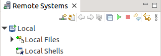
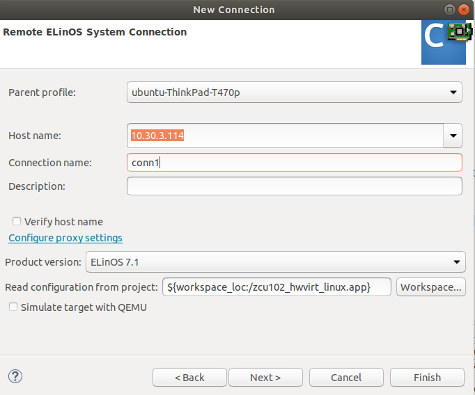
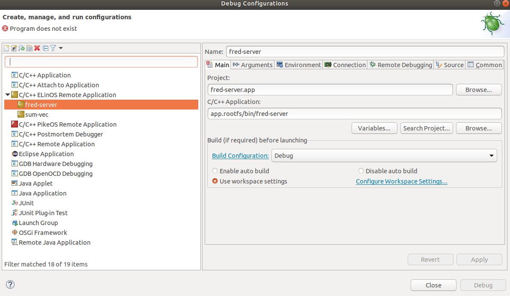
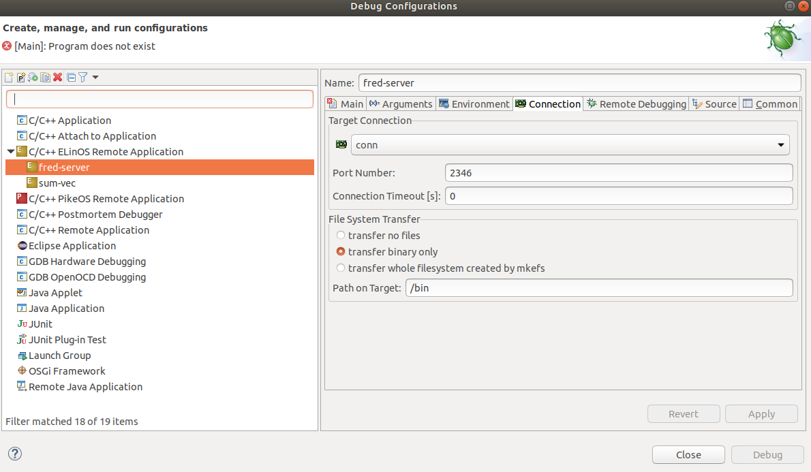
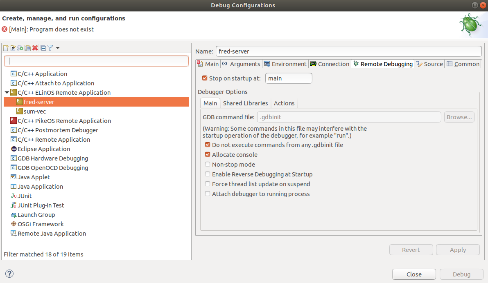
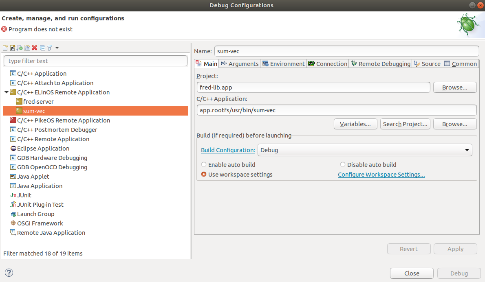

# fred-elinos

This is [ELinOS](https://www.sysgo.com/elinos) (by SysGo) realtime OS setup for the [FRED framework](https://fred-framework-docs.readthedocs.io/en/latest/index.html). 

Please go through all four ElinOS/PikeOS projects for more details.

## Generating the image

Run `make all` to build all four projects and `make install` to write the Linux image into the sd-card.

## Booting the ZCU102 Board

Place the SD card and run the following commands in the uboot terminal:

```
env default -a
setenv kernel_img hwvirt-linux-zynq-zcu102-hwvirt-uboot_dtb
boot
```

## Testing FRED with Device Tree Overlay

Device tree overlay is currently not working, but this was supposed to be the flow to apply the overlay during Linux execution. 

```
$ modprobe fred-buffctl
$ modprobe zynqmp-fpga-fmod
$ mkdir -p /lib/firmware
$ cp /opt/fredsys/dart_fred/bits/static.bin /lib/firmware/
$ cp /opt/fredsys/static.dtbo /lib/firmware/
$ mount -t configfs none /sys/kernel/config
$ mkdir -p /sys/kernel/config/device-tree/overlays/fred-static
$ echo 0 > /sys/class/fpga_manager/fpga0/flags
$ echo -n "static.dtbo" > /sys/kernel/config/device-tree/overlays/fred-static/path
        crash at this point !!! 
```

Make sure the device tree was generated with symbols included. This is not the defaut behaviour of ELinos, but the rule `boot` in `zcu102_hwvirt_linux.app/Makefile` has this command to make it happen:

```
make -C $(ELINOS_PROJECT)/linux ARCH=arm64 CROSS_COMPILE=$(CROSS_COMPILE) -j${ELINOS_MAKE_NUM_JOBS} $(DTB_FILE) DTC_FLAGS=-@
```

Finally, when testing the device tree feature, make sure that the current device tree does not already has `slot0` and `pr_decoupler0` defined.

## Testing FRED with Fixed Device Tree

Since device tree overlay is not working, this is the current workaround to add the FPGA configuration in Linux image building time.

```
modprobe fred-buffctl
modprobe zynqmp-fpga-fmod
mkdir -p /lib/firmware
cp /opt/fredsys/dart_fred/bits/static.bin /lib/firmware/
echo 0 > /sys/class/fpga_manager/fpga0/flags
cd /opt/fredsys
fred-server &
sum-vec
```

These commands lauch FRED device drivers, set the bitstream, launch the server and the sum-vec example application.

## Debugging FRED

The projects `fred-lib.app` and `fred-server.app` were made to enable step-by-step debug of both FRED client and server within CODEO.

### Create a Connection

In the *Remote Systems window*, select *Define a connection to remote system*. In the New Connection window, select CODEO -> ELinOS and click next. 



Then, as shown in the next image, set the static IP, which is configured to `10.30.4.114`, add a connection name (in this case `conn`), and set Product version to ELinOS 7.1, and Read configuration from project to `${workspace_loc:/zcu102_hwvirt_linux.app}`.




### Debug Configuration

It's necessary to create a Debug Configuration for each ElinOS Application Project, in this case `fred-lib.app` and `fred-server.app`. In CODEO, go to menu `Run -> Debug Configurations...`. Then add two *C/C++ ELinOS Remote Applications*. The first one called *fred-server* and the second one called *sum-vec*. For  fred-server, the relevant tabs are shown next. 







The sum-vec configuration is very similar. Next is the image of the *Main tab*. The *Connection tab* needs to use a different port number, let's say 2345. The *Remote Debugging tab* is the same as fred-server.




### Debugging

Since `fred-lib.app` and `fred-server.app` communicate with each other via sockets, the order and the location of the breakpoints matter. For example, a breakpoint in a part of a code that blocks a transaction (*fred_init*, *fred_bind*, and *fred_map_buff*, *fred_accel*) may cause a timeout and the server will close. 

### Current error

Currently, fred-server is crashing in the part of the code where the partial bitstream is copied to the fpga-mrg-fmod driver. To reproduce the error, the server is waiting requests.
The client starts its initialization with *fred_init*, *fred_bind*, and *fred_map_buff*. All goes well so far. When the client call fred_accel, it causes this cals stack to be generated from the server side:

#### UIO activation

```
decoup_drv_xil_decouple_() at decoup_drv_xil.c:36 0x5555551b34    
decoup_drv_decouple() at decoup_drv.h:35 0x555555aa5c 
slot_prepare_for_rcfg() at slot.h:147 0x555555ad68    
start_rcfg_() at scheduler_fred.c:117 0x555555b4fc    
push_req_fri_queue_() at scheduler_fred.c:168 0x555555b72c  
sched_fred_push_accel_req_() at scheduler_fred.c:273 0x555555bb74 
scheduler_push_accel_req() at scheduler.h:45 0x555555d410   
process_msg_() at sw_task_client.c:250 0x555555de20   
handle_event_() at sw_task_client.c:349 0x555555e12c  
event_handler_handle_event() at event_handler.h:74 0x5555559b68   
reactor_event_loop() at reactor_epoll.c:185 0x555555a100    
fred_sys_run() at fred_sys.c:512 0x5555555c28   
main() at main.c:54 0x5555551b14    
```

in the function *decoup_drv_xil_decouple_*:

```
base_addr = uio_get_base_addr(xil_dev_drv->uio_dev);    
REG_WRITE(base_addr, 0, 1);    <=== ERROR is fired here
```

*base_addr* has value 0x7ff7e37000.

This address is related to a device manually added into the device tree (called pr_decoupler_p0_s0), representing part of the hw design. It is bound to *uio1*. Here is it's stack trace when the UIO1 is read.

#### UIO (pr_decoupler_p0_s0 - uio1) initialization.

```
uio_dev_init() at uio_drv.c:132 0x55555535d4    
slot_drv_master_init() at slot_drv_master.c:209 0x5555552e3c      
slot_init() at slot.c:120 0x555555cd3c    
build_partitions_() at sys_layout.c:102 0x555555ec78  
sys_layout_init() at sys_layout.c:300 0x555555f5bc    
init_base_sys_() at fred_sys.c:96 0x5555554e98  
init_normal_mode_() at fred_sys.c:171 0x55555550b8    
fred_sys_init() at fred_sys.c:466 0x5555555ac8  
main() at main.c:49 0x5555551af4    
```

In the end of function `uio_dev_init`, the following mmap allocates the 0x7ff7e37000 address.

```
   // Map into the process memory space
    (*uio_dev)->map_base = (uintptr_t)mmap( NULL, (*uio_dev)->regs_size,
                                            PROT_READ | PROT_WRITE, MAP_SHARED,
                                            (*uio_dev)->uio_fd, 0 * getpagesize());
    if (!(*uio_dev)->map_base) {
        ERROR_PRINT("uio_drv: unable to mmap UIO device: %s\n", dev_name);
        close((*uio_dev)->uio_fd);
        free(*uio_dev);
        return -2;
    }
```

*(*uio_dev)->map_base* is 0x7ff7e37000. This is where the memory region that fails later is generated.

And this is the error message raised before ELinOS crashes.

```
#### HM EVENT in 22.4 "Linux-DTB"."guest core 3":
#### type=0x0 P4_HM_TYPE_UINT, id=0xa0000
#### msg="[P4HWVIRT_E_MNG_CPU_IOACCESS]: Guest tried to access data at invalid address"
#### lvl=0x1 P4_HM_LEVEL_PARTITION, dom=0x8 USER, code=0x0
#### pac=0x0 P4_HM_PAC_IDLE, mac=0x1 P4_HM_MAC_SHUTDOWN
#### pnotify=0x0, mnotify=0x0
```

Looking at this msg *msg="[P4HWVIRT_E_MNG_CPU_IOACCESS]: Guest tried to access data at invalid address"*. It seem to be PikeOS that it blocking this mem access. If so, how can we enable this mem access ?

## Acknowledgement

Thanks for Enkhtuvshin Janchivnyambuu and Andrej Kruták from [SYSGO](https://www.sysgo.com) for the tecnical support during this migration of FRED framework from Petalinux to Elinos.

## Contributions

  Did you find a bug in this layer ? Do you have some extensions or updates to add ? Please send us a Pull Request.

## Authors

 - Alexandre Amory (Feb 2023), [Real-Time Systems Laboratory (ReTiS Lab)](https://retis.santannapisa.it/), [Scuola Superiore Sant'Anna (SSSA)](https://www.santannapisa.it/), Pisa, Italy.

## Funding
 
This software package has been developed in the context of the [AMPERE project](https://ampere-euproject.eu/). This project has received funding from the European Union’s Horizon 2020 research and innovation programme under grant agreement No 871669.
